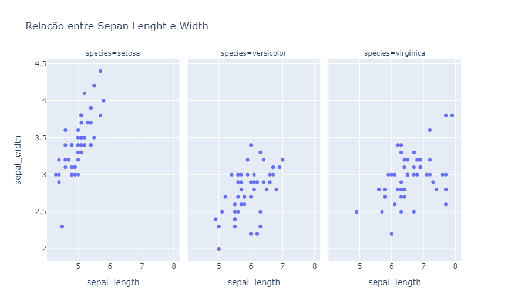

## 🔖 Sobre
Para esse trabalho utilizamos como fonte de estudo o curso de Python ministrado pelo professor [João Vitor](https://www.udemy.com/course/super-curso-de-python-3-resolvendo-problemas-reais/), desenvolvemos diversos tipos de gráficos para apoiar projetos de Ciência de Dados. O principal intuito é utilizar esse projeto como fonte de pesquisa para trabalho voltados a aplicação de Data Science.

- Manipulação de dados com Python
- Manipulação de dados com Pandas
- Firebase
- Visualização de dados

</br>

<p align="center"> 
  
</p>

</br>

## 🚀 Bibliotecas utilizadas

- [Plotly](https://plotly.com/)
- [Numpy](https://numpy.org/)
- [Matplotlib](https://matplotlib.org/)
- [Pandas](https://pandas.pydata.org/)
- [Firebase](https://firebase.google.com/)

</br>

## 🗂 Como baixar e iniciar o projeto

```bash
# Abra um terminal e copie este repositório com o comando
$ git clone https://github.com/cbvreis/Python-Firebase.git
# ou use a opção de download.

pip install -r requirements.txt

# Entrar no diretorio **/data-visualization**
$ cd Python-Firebase
```

## 🗂 Firebase

Para o banco de dados é necessário obter a autenticação diretamente do site [Firebase](https://firebase.google.com/).

<br>

Desenvolvido por [Cássio Reis](https://www.linkedin.com/in/cassioreisdevelop/) 🤓

